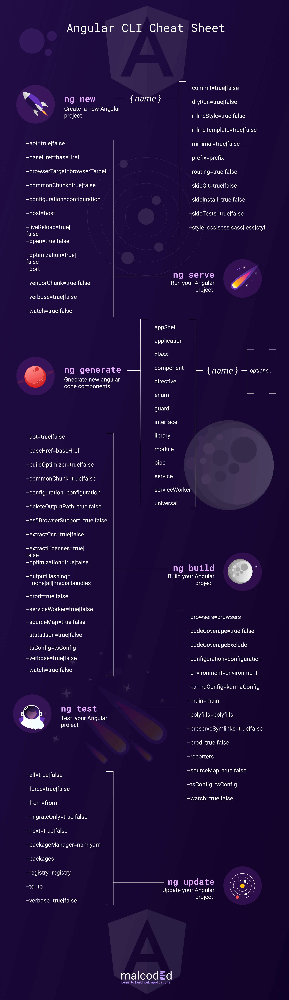

# Angular - mes notes

Angular (https://angular.dev/) est un framework JavaScript open-source développé et maintenu par Google. Il permet de créer des applications web dynamiques et réactives, principalement des applications à page unique (SPA). Angular utilise TypeScript (https://www.typescriptlang.org/) comme langage principal, ce qui apporte le typage statique et la programmation orientée objet à JavaScript. Le framework est basé sur une architecture de composants, où chaque élément de l'interface utilisateur est encapsulé dans des composants réutilisables.

Angular est particulièrement apprécié pour les applications d'entreprise complexes nécessitant une structure robuste et maintenable.

Voici les sections disponibles :

1. [Introduction et installation](docs/angular-intro.md)
2. [Composants et Modules](docs/angular-modules-components.md)
3. [Templates](docs/angular-templates.md)
4. [Data Binding](docs/angular-data-binding.md)
5. [Formulaires](docs/angular-forms.md)
- [Routing](docs/angular-routing.md)
- [Services et Injection de dépendances](docs/angular-services.md)
- [Observables (RxJS) et Subscriptions](docs/angular-observables-vs-promises.md)
- [Interceptors et Guards](docs/angular-interceptors-guards.md)

---

## 📌 Notes utiles

- `npx` permet d’utiliser `ng` sans installation globale
- Angular CLI cherche `angular.json` pour fonctionner
- Ton `node_modules/.bin` contient tous les exécutables locaux (dont `ng`)

## Angular cheatsheet

---

