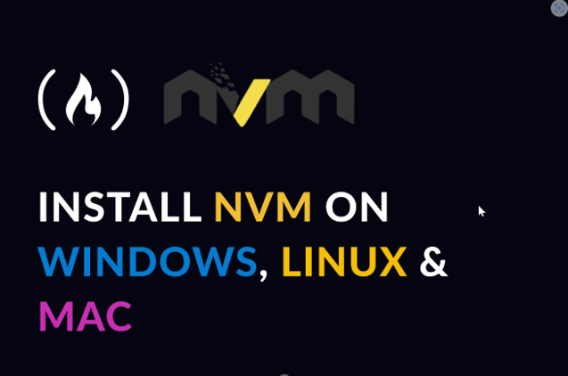
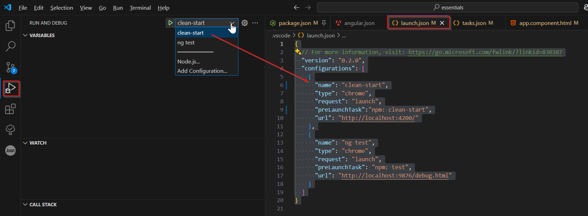
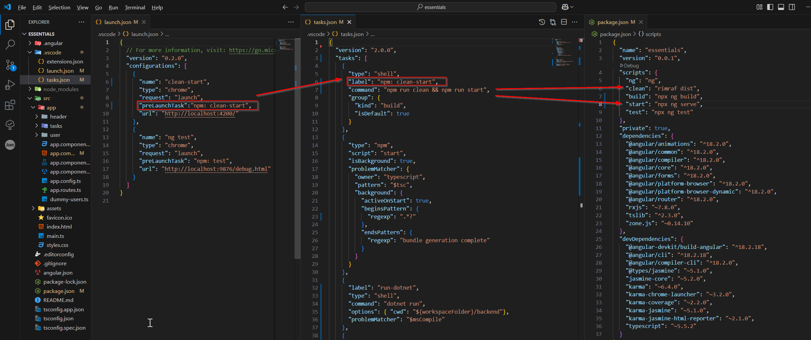

# Installation


## Installer nvm (Node Version Manager)



1.	Va sur : https://github.com/coreybutler/nvm-windows/releases
2.	Télécharge le nvm-setup.exe et installe 
3.	Installation dans : C:\Users\<*usr*>\AppData\Local\nvm

## NVM cheatsheet

Command | Description
---|---
`nvm --version` | Check if `nvm` is installed
`nvm install node` | Installs the latest release of node
`nvm install 14.7.0` | Installs a specific version
`nvm use 12.3` | npx ng g c header --flatUses a specific version of Node
`node -v > .nvmrc` | Creates an nvm configuration file
`nvm use` | Uses the version specified in the `.nvmrc` file
`nvm current` | Displays active version
`nvm ls` | Lists the installed versions
`nvm ls available` | Only show LTS (long-term support) versions
`nvm alias default 18.12` | Sets a default Node version to be used in any new shell (this refers to the latest installed v18.12.x version of node)
`nvm on` | on:Enable / off:desable
`nvm uninstall 17.0.1`| uninstall a version of node

#

# ⚙️ Workflow complet – Démarrer un projet Angular avec NVM et VS Code

## 🧰 Prérequis

- Node.js **géré avec `nvm-windows`** (https://github.com/coreybutler/nvm-windows)
- VS Code installé
- Git installé (facultatif, mais recommandé)

---

## 🧩 Étape 1 – Créer un dossier de projet

```bash
mkdir mon-projet-angular
cd mon-projet-angular
```

---

## 🔄 Étape 2 – Activer la bonne version de Node via `nvm`

par exemple, pour utiliser node v18.20.8
```bash
nvm install 18.20.8
nvm use 18.20.8
```
---

## 🧱 Étape 3 – Créer un projet Angular (qui va inclure Angular CLI) via npx  **(en local)**

# APPROCHE RECOMMANDÉE (installation en local)

| Explication | Commande |
|-------------|----------|
| Installation locale d'une version spécifique (dans `dependencies` de `package.json`) | `npx @angular/cli@18 new nom-du-projet` |
| Installation locale pour la **production** (dans `dependencies` de `package.json`) | `npm install @angular/cli --save` |
| Installation de la dernière version en local pour le **developpement** seulement (dans `devDependencies` de `package.json`) | `npm install --save-dev @angular/cli` |
| Installation globale - **⚠️ non recommandée** | `npm install -g @angular/cli` |
| Commande pour vérifier l'emplacement des packages globaux | `npm root -g` |

---

## 🧪 Étape 4 – Vérifier le fonctionnement de la CLI Angular

```bash
cd nom-du-projet
npx ng version
```

## 💻 Étape 5 – Ouvrir le projet dans VS Code

```bash
code .
```
🏗 Structure typique générée
```bash
nom-du-projet/
├── .vscode/
│   ├── launch.json
│   ├── tasks.json
│   │   └── ...
├── angular.json
├── src/
│   ├── app/
│   │   ├── app.component.ts
│   │   └── ...
├── angular.json
├── package.json
└── tsconfig.json
```

### Configurer environnement VsCode : 

Pour cet exemple, on suppose que le nom projet est (nom-du-projet = **essentials**)

### ✅ `package.json` : Le Cœur de la Gestion des Dépendances et des Scripts ###

**Utilité Principale** : Ce fichier est fondamental pour tout projet **Node.js** (et donc **Angular**). Il définit les dépendances du projet. **(node (npm))** en a besoin pour connaitre les librairies et outils externes dont le projet a besoin pour fonctionner ainsi que les scripts (des commandes automatisées qu'on peut exécuter via npm ou yarn).

En résumé :

➡️ `package.json` sert à gérer tout ce dont le projet Angular a besoin pour fonctionner, compiler et s'exécuter.

➡️ Il est lu par `npm install` pour installer toutes les librairies nécessaires.

Editer le fichier pour ajouter les scripts suivants:

```json
{
  "name": "essentials",
  "version": "0.0.1",
  "scripts": {
    "ng": "ng",
    "clean": "npx rimraf dist",
    "build": "npx ng build",
    "build:prod": "npx ng build --configuration production",
    "start": "npx ng serve",    
    "test": "npx ng test"
  },
```
**Note sur : [rimraf](https://www.npmjs.com/package/rimraf)**
```json
"scripts": {
  "clean": "npx rimraf dossier_à_supprimer"
}
```
**clean**: Ce script utilise la librairie `rimraf` (ou `rm -rf` sous Linux/macOS) pour supprimer récursivement le contenu du dossier `dist/essentials`. Si rimraf n'est pas installé globalement ou localement, il faut l'**installer en local** avec :

`npm install rimraf --save`.

Et ensuite, pour forcer l'utilisation de la version locale (et non globale),

Utiliser npx qui cherchera d'abord la version locale:

1. `npx rimraf dossier_à_supprimer` par exemple: `npx rimraf dist/essentials`

2. Définir un script dans le fichier package.json

3. Puis l'exécuter avec 

`npm run clean`


### ✅ `angular.json` : La Configuration du Projet Angular ###

**Utilité Principale** : Ce fichier est spécifique aux projets Angular créés avec la commande l'Angular CLI : `ng new mon-projet`

Il contient la configuration du projet Angular :
| Section clé | À quoi ça sert |
|-------------|----------------|
| `projects` | Définit les projets (souvent un seul, mais peut en avoir plusieurs) |
| `architect` | Contient les options pour `build`, `serve`, `test`, `lint` |
| `sourceRoot` | Emplacement du code source (ex : `"src"`) |
| `assets`, `styles`, `scripts` | Fichiers à inclure automatiquement (CSS, images, JS) |
| `outputPath` | Dossier où les fichiers compilés vont (`dist/mon-projet`) |


```json
"architect": {
        "build": {
          "builder": "@angular-devkit/build-angular:application",
          "options": {
            "outputPath": "dist/essentials",
            "index": "src/index.html",
            "browser": "src/main.ts",
            "polyfills": [
              "zone.js"
            ],
            "tsConfig": "tsconfig.app.json",
            "assets": [
              "src/favicon.ico",
              "src/assets"  
            ],
            "styles": [
              "src/styles.css"
            ],
            "scripts": []
          }          
```

### ✅ `.\vscode\launch.json` : La Configuration du Débogage dans vscode ###

**Utilité Principale** : Ce fichier est spécifique à VS Code et est utilisé pour configurer les lanceurs de débogage pour le projet.

Déclenche le débogage dans vscode puis dans Chrome.

Associe chaque démarrage inscrit dans `launch.json` à une tâche définie dans `tasks.json` via `**preLaunchTask**`.

Exemple : clean-start va d’abord lancer les commandes  `npm run clean && npm run start`, puis ouvrir le navigateur à http://localhost:4200/.

- Pour lancer le `Run and debug (Ctrl+Shift+D)`
- Installe l’extension **Debugger for Chrome** dans VS Code (ou Edge selon ton navigateur)
- Lance le debug via `F5` ou l’onglet "Run and Debug"

```jsonc
{
  // For more information, visit: https://go.microsoft.com/fwlink/?linkid=830387
  "version": "0.2.0",
  "configurations": [
    {
      "name": "clean-start",
      "type": "chrome",
      "request": "launch",
      "preLaunchTask":"npm: clean-start",
      "url": "http://localhost:4200/"
    },
    {
      "name": "ng test",
      "type": "chrome",
      "request": "launch",
      "preLaunchTask": "npm: test",
      "url": "http://localhost:9876/debug.html"
    }
  ]
}

```



### ✅ `.\vscode\tasks.json`  : L'Automatisation des Tâches ###

**Utilité Principale** : Ce fichier est également spécifique à VS Code et est utilisé pour automatiser des tâches répétitives liées au projet. Il permet de définir des tâches qui peuvent exécuter des commandes shell, des scripts npm, des commandes du CLI Angular, ou d'autres outils.

**Accès:**
Avec une simple commande ou raccourci clavier via la palette de commandes

 `(Ctrl+Shift+P > "Run Task" > "Start Angular Dev Server")`

ou via le menu: 

`Terminal > Run Tasks...` ou `Terminal > Run Build Tasks...`

```json
{
  "version": "2.0.0",
  "tasks": [
    {
      "type": "shell",
      "label": "npm: clean-start",
      "command": "npm run clean && npm run start",
      "group": {
        "kind": "build",
        "isDefault": true
      },
      "isBackground": true,
      "problemMatcher": {
        "owner": "typescript",
        "pattern": "$tsc",
        "background": {
          "activeOnStart": true,
          "beginsPattern": {
            "regexp": "(.*?)"
          },
          "endsPattern": {
            "regexp": "bundle generation complete"
          }
        }
      }
    },
    {
      "type": "npm",
      "script": "start",
      "isBackground": true,
      "problemMatcher": {
        "owner": "typescript",
        "pattern": "$tsc",
        "background": {
          "activeOnStart": true,
          "beginsPattern": {
            "regexp": ".*?"
          },
          "endsPattern": {
            "regexp": "bundle generation complete !!!"
          }
        }
      }
    },
    {
      "label": "run-dotnet",
      "type": "shell",
      "command": "dotnet run",
      "options": {
        "cwd": "${workspaceFolder}/backend"
      },
      "problemMatcher": "$msCompile"
    },
    {
      "label": "start all (Angular + .NET)",
      "dependsOn": ["npm: start", "run-dotnet"],
      "dependsOrder": "parallel"
    }
  ]
}

```



### ✅ [`tsconfig.json`](https://www.typescriptlang.org/docs/handbook/tsconfig-json.html)  : La Configuration de Base du Projet TypeScript ###

**Utilité Principale** : Ce fichier se trouve généralement à la racine du projet Angular et sert de configuration de base pour le compilateur TypeScript pour l'ensemble du projet. Il spécifie les options de compilation par défaut et peut inclure ou exclure certains fichiers du processus de compilation.

Il définit :

* des règles générales de compilation (comme la version du langage),

 * les chemins de base,

 * les options partagées par d'autres fichiers `tsconfig.*.json`.


📄 tsconfig.json — Globale

```jsonc
{
  "compilerOptions": {
    "target": "ES2022",           // Version JS générée (ex: ES2022 → moderne)
    "module": "ESNext",           // Système de modules (ESNext recommandé pour Angular)
    "strict": true,               // Active les règles strictes (bonnes pratiques)
    "baseUrl": "./",              // Point de base pour les imports relatifs
    "paths": {  }                 // Alias de chemins si besoin
  },
  "exclude": ["./docs"],          // Dossiers à ignorer
  "references": [
    { "path": "./tsconfig.app.json" },
    { "path": "./tsconfig.spec.json" }
  ]
}

```

Un autre exemple:
```jsonc
{
  "compileOnSave": false,                // Ne recompile pas automatiquement à la sauvegarde dans VSCode

  "compilerOptions": {
    "baseUrl": "./",                    // Point de départ pour les imports relatifs
    "downlevelIteration": true,         // Permet l'utilisation de 'for...of' et '...spread' avec des targets plus anciens
    "outDir": "./dist/out-tsc",         // Répertoire de sortie pour les fichiers compilés
    "sourceMap": true,                  // Génère des fichiers .map pour le debug
    "declaration": false,               // Ne génère pas de fichiers .d.ts (déclarations de types)
    "module": "es2020",                 // Type de modules JS générés (ES2020 → moderne)
    "moduleResolution": "node",         // Utilise la résolution de modules de Node.js
    "experimentalDecorators": true,     // Active les décorateurs TypeScript (requis par Angular)
    "importHelpers": true,              // Utilise tslib pour éviter la duplication de helpers
    "target": "ES2022",                 // Version JavaScript générée par le compilateur
    "typeRoots": [
      "node_modules/@types"            // Où chercher les définitions de types (ex: types pour Jest, Jasmine, etc.)
    ],
    "lib": [
      "es2018",                         // Bibliothèques JS inclues dans le build
      "es2019",
      "dom"                             // Inclut les API du navigateur (DOM, HTML)
    ],
    "skipLibCheck": true,              // Ignore les erreurs dans les fichiers de type (.d.ts) des librairies externes
    "resolveJsonModule": true,         // Permet d’importer des fichiers JSON dans le code
    "esModuleInterop": true,           // Facilite l'import de modules CommonJS avec `import x from 'y'`
    "paths": {                         // Définition des chemins personnalisés (alias)
      "@angular/*": [
        "node_modules/@angular"
      ],
      "rxjs": [
        "node_modules/rxjs"
      ],
      "rxjs/*": [
        "node_modules/rxjs/*"
      ]
    },
    "useDefineForClassFields": false   // Gère comment les champs de classe sont émis (Angular recommande false)
  },

  "angularCompilerOptions": {
    "fullTemplateTypeCheck": true,     // Vérification stricte des types dans les templates HTML
    "strictInjectionParameters": true  // Angular vérifie que tous les services injectés sont bien définis
  }
}

```


### ✅ [`tsconfig.app.json`](https://www.typescriptlang.org/docs/handbook/tsconfig-json.html)  : La Configuration Spécifique à l'Application ###

**Utilité Principale** : Ce fichier étend (*extends*) généralement `tsconfig.json` et fournit des configurations spécifiques pour la compilation du code source principal de l'application (celui qui se trouve généralement dans le dossier src).

Il :

* étend `tsconfig.json` (hérite de ses options),

* précise les fichiers et répertoires à inclure (ex : `src/**/*.ts`),

 * est référencé dans `angular.json` (dans la section `build.options.tsConfig`).

📄 tsconfig.app.json — Spécifique à l'application Angular
 ```jsonc
 {
  "extends": "../tsconfig.json",         // Hérite de la configuration globale (chemins, options de compilation...)

  "compilerOptions": {
    "outDir": "../out-tsc/app",          // Où placer les fichiers compilés de l'application (hors tests)
    "types": []                          // Ne charge aucun type spécifique (ex : pas de types Jasmine pour les tests)
  },

  "files": [
    "main.ts",                           // Fichier d’entrée principal de l’application Angular
    "polyfills.ts"                       // Fichier des polyfills (compatibilité avec navigateurs anciens)
  ],

  "include": [
    "src/**/*.d.ts"                      // Inclut tous les fichiers de définitions de types dans `src/`
  ]
}
```

**À retenir :**
* Il hérite des règles du tsconfig.json.

* Il est centré sur le code applicatif Angular uniquement, pas les tests.

* Il est utilisé quand tu fais :

```bash
npx ng build
npx ng serve
```

📁 Structure habituelle

```pgsql
/tsconfig.json              <-- global (racine du projet)
/angular.json
/package.json

/src/
  tsconfig.app.json         <-- spécifique à l'application Angular
  tsconfig.spec.json        <-- spécifique aux tests

```

---

## 🐞 Étape 6 – Lancer la compilation et le serveur Angular en mode debug

```bash

npx ng build
npx ng serve

# comme les node_modules sont installés localement
# lorsque
npm run clean -> 
  > essentials@0.0.1 clean
  > rimraf dist/essentials

# lorsque
npm run build ->
  > essentials@0.0.1 build       
  > npm run clean && npx ng build

# lorsque
npm run start ->
  > essentials@0.0.1 start
  > npx ng serve  
```

🟢 Tu devrais voir (quelque chose comme) : `Application bundle generation complete...`

```ps
Initial chunk files   | Names         |  Raw size | Estimated transfer size
main-PNNANPO6.js      | main          | 201.22 kB |                53.94 kB
polyfills-FFHMD2TL.js | polyfills     |  34.52 kB |                11.28 kB
styles-PH5QZW6A.css   | styles        | 186 bytes |               186 bytes

                      | Initial total | 235.92 kB |                65.41 kB

Application bundle generation complete. [1.916 seconds]

Output location: C:\Applications\SampleDEV\angular-sandbox\the-complete-guide\essentials\dist\essentials
```

💡 Accès via `http://localhost:4200`

---

## 🧪 Étape 8 - Commandes Angular utiles
Ouvre la fenêtre Terminal

## Génération de composants et services avec Angular CLI

### Composant avec dossier dédié
```bash
# Génère un composant Angular dans un nouveau dossier "ma-page"
npx ng generate component ma-page
```

### Service Angular
```bash
# Génère un service Angular nommé "mon-service" (fichiers créés dans src/app)
npx ng generate service mon-service
```

### Composant sans sous-dossier
```bash
# Génère un composant "header" sans créer de sous-dossier (fichiers dans le dossier courant)
npx ng generate component header --flat
```

### Simulation (dry run) d’un composant sans sous-dossier
```bash
# Simule la génération du composant "mon-composant" sans créer de dossier
# (affiche les fichiers qui seraient créés, sans rien modifier)
npx ng generate component mon-composant --flat --dry-run
```

---

## Abréviations pratiques

| Longue option              | Abrégé  |
|---------------------------|---------|
| `generate`                | `g`     |
| `component`               | `c`     |
| `service`                 | `s`     |
| `--flat`                  | `-f`    |
| `--dry-run`               | `-d`    |
| `--skip-tests`            | `-t`    |

### Exemple avec abréviations :
```bash
npx ng g c header -f -d
```

> 💡 Utile pour tester une commande sans rien créer.


---

## 🔄 Étape 9 – Ajouter la solution dans GitHub
Consulter la page : **Dépôt pédagogique** (https://github.com/jfdesjardins2000/MesNOTES/tree/main/GithubUnLicence) pour Ajouter une licence libre (The Unlicense).

---

## ✅ Tu es prêt à coder 🚀

---

## Gestion d'Erreurs possibles :

Dans mon projet angular je rencontre cette erreur: Erreur critique : npm error code SELF_SIGNED_CERT_IN_CHAIN

✅ Solution recommandée (si possible) : corriger la chaîne de certificats
Si tu es derrière un proxy d'entreprise avec des certificats auto-signés, demande à ton équipe TI :

Le certificat racine de confiance (au format .crt ou .pem)

Et ajoute-le manuellement à la configuration de npm via :


```bash
npm config set cafile "chemin/vers/ton/certificat.crt"
```
⚠️ Solution temporaire (non sécurisée, à utiliser avec précaution)
Tu peux dire à npm d’ignorer les erreurs de certificat :

```bash
npm config set strict-ssl false
```
Cela désactive la vérification SSL. C'est pratique pour avancer, mais risqué en production ou sur des réseaux non sécurisés.

🔁 Autre alternative : utiliser un registre npm sécurisé
Si le problème vient d’un registre personnalisé (interne), tu peux forcer npm à utiliser le registre public :

```bash
npm config set registry https://registry.npmjs.org/
```

🧪 Pour tester temporairement une commande (sans changer la config globale)
Tu peux faire :

```bash
NODE_TLS_REJECT_UNAUTHORIZED=0 npm install
```
Encore une fois : non recommandé à long terme, mais utile pour débloquer une situation.

💡 Vérifie aussi :
Ton fichier .npmrc (global ou local) — il pourrait contenir des réglages problématiques.

Ton environnement réseau : un proxy, un antivirus ou un pare-feu peut altérer la chaîne de certificats.

