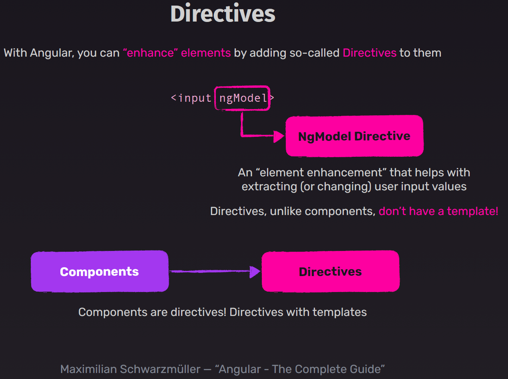

# Templates et Directives dans Angular : La Base de la Construction de Vue


## Introduction

Les templates HTML constituent le cœur de la façon dont Angular affiche l'interface utilisateur. Ils définissent la façon dont l'application est rendue dans le navigateur, permettant une liaison dynamique entre la vue et les données. Angular étend la syntaxe HTML traditionnelle avec des fonctionnalités supplémentaires qui permettent d'exprimer la logique de présentation de manière déclarative.





## Interpolation

L'interpolation est le mécanisme le plus fondamental pour afficher des données dans un template Angular. Elle utilise des doubles accolades `{{ }}` pour insérer des valeurs dynamiques dans le HTML.

```typescript
// Dans le composant
export class UserProfileComponent {
  userName = 'Alice';
  currentDate = new Date();
}
```

```html
<h1>Bonjour, {{ userName }} !</h1>
<p>Nous sommes le {{ currentDate | date:'dd/MM/yyyy' }}</p>
```

L'interpolation peut contenir des expressions JavaScript simples et des appels de méthodes :

```html
<p>La somme est : {{ 1 + 2 }}</p>
<p>Le nom en majuscules : {{ userName.toUpperCase() }}</p>
```

## Liaisons de Propriétés (Property Binding)

La liaison de propriétés permet de définir dynamiquement les valeurs des attributs HTML et des propriétés des composants. Elle utilise la syntaxe `[propriété]="expression"`.

```html

<button [disabled]="isSubmitting">Envoyer</button>
```

La liaison de propriétés est unidirectionnelle, du composant vers le DOM.

## Liaisons d'Événements (Event Binding)

La liaison d'événements permet de répondre aux événements du DOM. Elle utilise la syntaxe `(événement)="expression"`.

```html
<button (click)="saveData()">Sauvegarder</button>
<input (input)="onInputChange($event)" (blur)="onInputBlur()">
```

L'objet `$event` contient des informations sur l'événement déclenché.

## Liaison Bidirectionnelle (Two-way Binding)

Angular propose également une liaison bidirectionnelle qui combine la liaison de propriété et la liaison d'événement. Elle utilise la syntaxe `[(ngModel)]="propriété"`.

```html
<input [(ngModel)]="userName">
<p>Vous avez saisi : {{ userName }}</p>
```

Pour utiliser `ngModel`, il faut importer le module `FormsModule` dans le module de l'application.

---


## Directives Structurelles

Les directives structurelles modifient la structure du DOM en ajoutant, supprimant ou manipulant des éléments.

### *ngIf

`*ngIf` permet d'ajouter ou de supprimer conditionnellement des éléments du DOM :

```html
<div *ngIf="isLoggedIn">Bienvenue, {{ userName }} !</div>
<div *ngIf="!isLoggedIn">Veuillez vous connecter</div>
```

On peut également utiliser la syntaxe avec else :

```html
<div *ngIf="isLoggedIn; else loginBlock">Contenu pour utilisateurs connectés</div>
<ng-template #loginBlock>Veuillez vous connecter pour accéder au contenu</ng-template>
```

### *ngFor

`*ngFor` permet d'itérer sur des collections :

```html
<ul>
  <li *ngFor="let item of items; let i = index; trackBy: trackByFn">
    {{ i + 1 }}. {{ item.name }}
  </li>
</ul>
```

Options disponibles avec `*ngFor` :
- `index` : position de l'élément actuel
- `first`, `last` : booléens indiquant si l'élément est le premier ou le dernier
- `even`, `odd` : booléens indiquant si l'index est pair ou impair
- `trackBy` : fonction pour optimiser les performances en identifiant uniquement les éléments modifiés

### *ngSwitch

`*ngSwitch` permet de choisir parmi plusieurs alternatives :

```html
<div [ngSwitch]="userRole">
  <div *ngSwitchCase="'admin'">Panel d'administration</div>
  <div *ngSwitchCase="'editor'">Interface d'édition</div>
  <div *ngSwitchDefault>Accès utilisateur standard</div>
</div>
```

## Directives d'Attributs

Les directives d'attributs modifient l'apparence ou le comportement d'un élément existant.

### ngClass

`ngClass` permet d'ajouter ou supprimer dynamiquement des classes CSS :

```html
<div [ngClass]="{'active': isActive, 'disabled': isDisabled, 'highlight': isHighlighted}">
  Contenu avec classes conditionnelles
</div>
```

### ngStyle

`ngStyle` permet de définir dynamiquement des styles inline :

```html
<div [ngStyle]="{'color': textColor, 'font-size.px': fontSize, 'background-color': bgColor}">
  Contenu avec styles dynamiques
</div>
```

## Pipes

Les pipes transforment les données avant de les afficher :

```html
<p>{{ product.price | currency:'EUR':'symbol':'1.2-2' }}</p>
<p>{{ dateNaissance | date:'longDate' | uppercase }}</p>
```

Angular propose plusieurs pipes intégrés :
- `date` : formatage de dates
- `uppercase`, `lowercase` : conversion de casse
- `currency` : formatage de devises
- `decimal` : formatage de nombres
- `percent` : formatage de pourcentages
- `async` : gestion des Observable et Promise
- `json` : affichage formaté d'objets (utile pour le débogage)

## Templates de Référence (Template Reference Variables)

Les variables de référence permettent d'accéder directement à des éléments du DOM :

```html
<input #userInput (input)="0">
<button (click)="updateName(userInput.value)">Mettre à jour</button>
<p>Valeur en cours : {{ userInput.value }}</p>
```

## Contenu Projeté (Content Projection)

La projection de contenu permet d'insérer du contenu externe dans un composant :

```html
<!-- Dans le template du composant parent -->
<app-card>
  <h2 class="title">Titre de la carte</h2>
  <div class="content">Contenu de la carte</div>
</app-card>

<!-- Dans le template du composant app-card -->
<div class="card">
  <div class="card-header">
    <ng-content select=".title"></ng-content>
  </div>
  <div class="card-body">
    <ng-content select=".content"></ng-content>
  </div>
</div>
```


## Custom directives Guide
Voir la section [Les Directives en Angular](./09-angular-custom-directives-guide.md)


## Bonnes Pratiques

1. **Logique minimale** : Garder les templates aussi simples que possible, en déplaçant la logique complexe dans le composant.
2. **Performance** : Utiliser `trackBy` avec `*ngFor` pour les listes longues ou qui changent fréquemment.
3. **Accessibilité** : S'assurer que les templates génèrent du HTML sémantique et accessible.
4. **Organisation** : Décomposer les interfaces complexes en composants plus petits et réutilisables.
5. **Validation** : Utiliser les outils d'analyse statique et la vérification de type stricte pour les templates.

## Conclusion

Les templates Angular offrent un système puissant et expressif pour créer des interfaces utilisateur dynamiques. La combinaison de l'interpolation, des liaisons de propriétés et d'événements, et des directives permet de construire des vues réactives et interactives. En maîtrisant ces concepts fondamentaux, les développeurs peuvent créer des applications web modernes avec une séparation claire entre la logique et la présentation.
