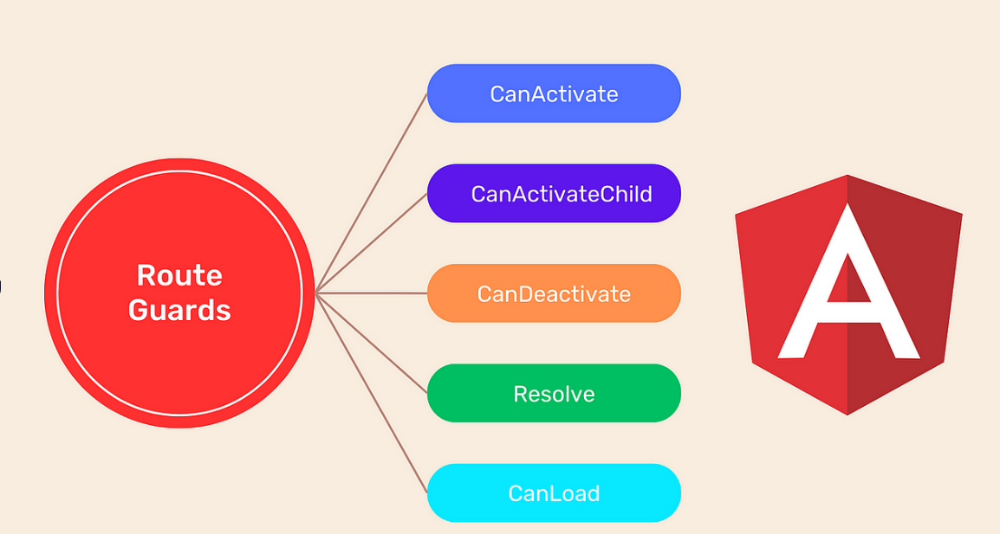
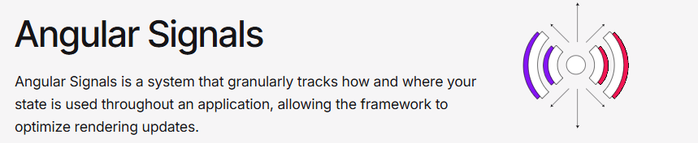

# Les Interceptors et Guards en Angular: De NgModule à Standalone

## Introduction

Les interceptors et guards sont des éléments essentiels pour sécuriser et enrichir les applications Angular. Ces fonctionnalités ont connu une transformation significative avec l'évolution vers l'architecture standalone. Cet article explore en détail ces deux concepts, leur fonctionnement traditionnel et leur implémentation moderne.

## Partie 1: Les Guards en Angular

### Concept et Rôle des Guards

Les guards sont des mécanismes de protection des routes qui permettent ou empêchent la navigation de l'utilisateur selon certaines conditions. Ils répondent à des questions cruciales telles que:

- L'utilisateur est-il autorisé à accéder à cette page?
- L'utilisateur peut-il quitter cette page avec des modifications non enregistrées?
- Les données nécessaires sont-elles chargées avant l'affichage de la page?

### Types de Guards Traditionnels

Avant Angular 15, les guards étaient principalement implémentés comme des classes implémentant des interfaces spécifiques:

1. **CanActivate**: Détermine si une route peut être activée
2. **CanActivateChild**: Contrôle l'accès aux routes enfants
3. **CanDeactivate**: Vérifie si l'utilisateur peut quitter une route
4. **CanLoad**: Détermine si un module peut être chargé paresseusement
5. **Resolve**: Pré-charge des données avant d'activer la route



### Implémentation Traditionnelle avec NgModule

Avec l'approche NgModule, les guards étaient définis comme des classes avec des interfaces:

```typescript
// auth.guard.ts - Approche NgModule
import { Injectable } from '@angular/core';
import { 
  CanActivate, 
  ActivatedRouteSnapshot, 
  RouterStateSnapshot, 
  Router 
} from '@angular/router';
import { AuthService } from './auth.service';

@Injectable({
  providedIn: 'root'
})
export class AuthGuard implements CanActivate {
  constructor(private authService: AuthService, private router: Router) {}

  canActivate(
    route: ActivatedRouteSnapshot,
    state: RouterStateSnapshot
  ): boolean {
    if (this.authService.isAuthenticated()) {
      return true;
    }
    
    // Redirection vers la page de connexion
    this.router.navigate(['/login'], { 
      queryParams: { returnUrl: state.url }
    });
    return false;
  }
}
```

Puis ils étaient utilisés dans la configuration des routes:

```typescript
// app-routing.module.ts
const routes: Routes = [
  { path: '', component: HomeComponent },
  { 
    path: 'admin', 
    component: AdminComponent, 
    canActivate: [AuthGuard] 
  },
  { 
    path: 'profile', 
    component: ProfileComponent,
    canActivate: [AuthGuard],
    canDeactivate: [UnsavedChangesGuard]
  }
];

@NgModule({
  imports: [RouterModule.forRoot(routes)],
  exports: [RouterModule]
})
export class AppRoutingModule { }
```

### Guards Fonctionnels (Angular 15+)

À partir d'Angular 15, les guards peuvent être implémentés comme de simples fonctions, ce qui simplifie considérablement le code:

```typescript
// auth.guard.ts - Approche Standalone
import { inject } from '@angular/core';
import { Router } from '@angular/router';
import { AuthService } from './auth.service';

export const authGuard = (route, state) => {
  const authService = inject(AuthService);
  const router = inject(Router);
  
  if (authService.isAuthenticated()) {
    return true;
  }
  
  return router.createUrlTree(['/login'], { 
    queryParams: { returnUrl: state.url }
  });
};
```

Utilisation avec le routage standalone:

```typescript
// routes.ts
import { Routes } from '@angular/router';
import { authGuard } from './guards/auth.guard';
import { unsavedChangesGuard } from './guards/unsaved-changes.guard';

export const APP_ROUTES: Routes = [
  { path: '', component: HomeComponent },
  { 
    path: 'admin', 
    component: AdminComponent, 
    canActivate: [authGuard] 
  },
  { 
    path: 'profile', 
    component: ProfileComponent,
    canActivate: [authGuard],
    canDeactivate: [unsavedChangesGuard]
  }
];
```

### Nouvelles API de Guards (Angular 16+)

Angular 16 a introduit de nouvelles API pour les guards qui remplacent les interfaces précédentes:

```typescript
// admin.guard.ts
import { inject } from '@angular/core';
import { 
  CanActivateFn, 
  CanMatchFn 
} from '@angular/router';
import { AuthService } from './auth.service';

export const canActivateAdmin: CanActivateFn = (route, state) => {
  const authService = inject(AuthService);
  return authService.hasAdminRole();
};

export const canMatchAdmin: CanMatchFn = (route, segments) => {
  const authService = inject(AuthService);
  return authService.hasAdminRole();
};
```

### CanMatch vs CanActivate

Avec Angular 14+, `canMatch` a été introduit comme remplacement de `canLoad`:

- **canActivate**: Vérifie après que la route correspond, mais avant l'activation
- **canMatch**: Vérifie pendant le processus de correspondance des URL, avant même que la route ne soit considérée comme correspondante

```typescript
const routes: Routes = [
  {
    path: 'admin',
    canMatch: [canMatchAdmin], // Vérifié pendant la correspondance des routes
    loadChildren: () => import('./admin/admin.routes').then(r => r.ADMIN_ROUTES)
  }
];
```

### Utilisation Avancée des Guards

#### Guard Combinant Plusieurs Conditions

```typescript
export const complexGuard: CanActivateFn = (route, state) => {
  const authService = inject(AuthService);
  const featureService = inject(FeatureService);
  const router = inject(Router);
  
  // Combinaison de plusieurs conditions
  if (!authService.isAuthenticated()) {
    return router.createUrlTree(['/login']);
  }
  
  if (!featureService.isFeatureEnabled('admin-panel')) {
    return router.createUrlTree(['/access-denied']);
  }
  
  return true;
};
```

#### Guard avec Observables et Promesses

```typescript
export const asyncGuard: CanActivateFn = async (route, state) => {
  const userService = inject(UserService);
  const router = inject(Router);
  
  try {
    // Attendre une vérification asynchrone
    const hasPermission = await userService.checkPermission(route.params.id);
    
    if (hasPermission) {
      return true;
    } else {
      return router.createUrlTree(['/unauthorized']);
    }
  } catch (error) {
    console.error('Permission check failed', error);
    return router.createUrlTree(['/error']);
  }
};
```

#### Data Resolver Fonctionnel

```typescript
// user-data.resolver.ts
import { inject } from '@angular/core';
import { ResolveFn } from '@angular/router';
import { UserService } from './user.service';
import { catchError, of } from 'rxjs';

export const userDataResolver: ResolveFn<User> = (route, state) => {
  const userService = inject(UserService);
  const userId = route.paramMap.get('id');
  
  return userService.getUser(userId).pipe(
    catchError(() => {
      // Retourner un utilisateur par défaut en cas d'erreur
      return of({ id: userId, name: 'Unknown', role: 'guest' });
    })
  );
};

// Utilisation
const routes: Routes = [
  {
    path: 'users/:id',
    component: UserDetailComponent,
    resolve: { user: userDataResolver }
  }
];
```

## Partie 2: Les Interceptors HTTP en Angular

### Concept et Rôle des Interceptors

Les interceptors HTTP sont des services qui permettent d'intercepter et de modifier les requêtes HTTP entrantes et sortantes. Ils sont particulièrement utiles pour:

- Ajouter des en-têtes d'authentification (tokens JWT)
- Gérer les erreurs de manière centralisée
- Implémenter des logs ou métriques pour les requêtes
- Gérer les indicateurs de chargement global
- Transformer les réponses

### Interceptors avec NgModule

Dans l'approche traditionnelle, les interceptors étaient implémentés comme des classes avec l'interface `HttpInterceptor`:

```typescript
// auth.interceptor.ts - Approche NgModule
import { Injectable } from '@angular/core';
import {
  HttpRequest,
  HttpHandler,
  HttpEvent,
  HttpInterceptor
} from '@angular/common/http';
import { Observable } from 'rxjs';
import { AuthService } from './auth.service';

@Injectable()
export class AuthInterceptor implements HttpInterceptor {
  constructor(private authService: AuthService) {}

  intercept(
    request: HttpRequest<unknown>, 
    next: HttpHandler
  ): Observable<HttpEvent<unknown>> {
    const token = this.authService.getToken();
    
    if (token) {
      // Cloner la requête et ajouter le token
      const authRequest = request.clone({
        setHeaders: {
          Authorization: `Bearer ${token}`
        }
      });
      
      return next.handle(authRequest);
    }
    
    return next.handle(request);
  }
}
```

Puis ils étaient enregistrés dans le module principal:

```typescript
// app.module.ts
import { HTTP_INTERCEPTORS } from '@angular/common/http';
import { AuthInterceptor } from './interceptors/auth.interceptor';
import { ErrorInterceptor } from './interceptors/error.interceptor';

@NgModule({
  declarations: [AppComponent],
  imports: [BrowserModule, HttpClientModule],
  providers: [
    { provide: HTTP_INTERCEPTORS, useClass: AuthInterceptor, multi: true },
    { provide: HTTP_INTERCEPTORS, useClass: ErrorInterceptor, multi: true }
  ],
  bootstrap: [AppComponent]
})
export class AppModule { }
```

### Interceptors avec l'Architecture Standalone

Angular 16+ a introduit une nouvelle façon de configurer les interceptors avec l'approche standalone via la fonction `provideHttpClient`:

```typescript
// main.ts
import { bootstrapApplication } from '@angular/platform-browser';
import { provideHttpClient, withInterceptors } from '@angular/common/http';
import { AppComponent } from './app/app.component';
import { authInterceptor } from './app/interceptors/auth.interceptor';
import { errorInterceptor } from './app/interceptors/error.interceptor';

bootstrapApplication(AppComponent, {
  providers: [
    provideHttpClient(
      withInterceptors([
        authInterceptor,
        errorInterceptor
      ])
    )
  ]
});
```

Les interceptors sont désormais implémentés sous forme de fonctions:

```typescript
// auth.interceptor.ts - Approche Standalone
import { HttpInterceptorFn } from '@angular/common/http';
import { inject } from '@angular/core';
import { AuthService } from '../services/auth.service';

export const authInterceptor: HttpInterceptorFn = (req, next) => {
  const authService = inject(AuthService);
  const token = authService.getToken();
  
  if (token) {
    const authReq = req.clone({
      setHeaders: {
        Authorization: `Bearer ${token}`
      }
    });
    
    return next(authReq);
  }
  
  return next(req);
};
```

### Support des Interceptors de Classe Existants

Pour la compatibilité avec les interceptors de classe existants, Angular fournit `withInterceptorsFromDi`:

```typescript
// main.ts
import { bootstrapApplication } from '@angular/platform-browser';
import { 
  provideHttpClient, 
  withInterceptors, 
  withInterceptorsFromDi 
} from '@angular/common/http';
import { HTTP_INTERCEPTORS } from '@angular/common/http';
import { authInterceptor } from './app/interceptors/auth.interceptor';
import { LegacyInterceptor } from './app/interceptors/legacy.interceptor';

bootstrapApplication(AppComponent, {
  providers: [
    // Interceptor de classe existant
    { provide: HTTP_INTERCEPTORS, useClass: LegacyInterceptor, multi: true },
    
    provideHttpClient(
      // Nouveaux interceptors fonctionnels
      withInterceptors([authInterceptor]),
      // Support des interceptors de classe
      withInterceptorsFromDi()
    )
  ]
});
```

### Exemples Avancés d'Interceptors

#### Interceptor de Gestion d'Erreurs

```typescript
// error.interceptor.ts
import { HttpInterceptorFn, HttpStatusCode } from '@angular/common/http';
import { inject } from '@angular/core';
import { catchError, throwError } from 'rxjs';
import { NotificationService } from '../services/notification.service';
import { Router } from '@angular/router';

export const errorInterceptor: HttpInterceptorFn = (req, next) => {
  const notificationService = inject(NotificationService);
  const router = inject(Router);
  
  return next(req).pipe(
    catchError(error => {
      switch (error.status) {
        case HttpStatusCode.Unauthorized:
          notificationService.showError('Session expirée. Veuillez vous reconnecter.');
          router.navigate(['/login']);
          break;
          
        case HttpStatusCode.Forbidden:
          notificationService.showError('Vous n\'avez pas les droits nécessaires.');
          break;
          
        case HttpStatusCode.NotFound:
          notificationService.showError('La ressource demandée n\'existe pas.');
          break;
          
        case HttpStatusCode.InternalServerError:
          notificationService.showError('Une erreur serveur est survenue.');
          break;
          
        default:
          notificationService.showError('Une erreur est survenue.');
      }
      
      return throwError(() => error);
    })
  );
};
```

#### Interceptor de Cache

```typescript
// cache.interceptor.ts
import { HttpInterceptorFn, HttpResponse } from '@angular/common/http';
import { inject } from '@angular/core';
import { Observable, of, tap } from 'rxjs';
import { CacheService } from '../services/cache.service';

export const cacheInterceptor: HttpInterceptorFn = (req, next) => {
  // Ne mettre en cache que les requêtes GET
  if (req.method !== 'GET') {
    return next(req);
  }
  
  const cacheService = inject(CacheService);
  const cachedResponse = cacheService.get(req.url);
  
  // Retourner la réponse en cache si disponible
  if (cachedResponse) {
    return of(cachedResponse);
  }
  
  // Sinon, exécuter la requête et mettre en cache la réponse
  return next(req).pipe(
    tap(event => {
      if (event instanceof HttpResponse) {
        cacheService.set(req.url, event, 60000); // Mettre en cache pour 1 minute
      }
    })
  );
};
```

#### Interceptor de Journalisation

```typescript
// logging.interceptor.ts
import { HttpInterceptorFn } from '@angular/common/http';
import { inject } from '@angular/core';
import { finalize, tap } from 'rxjs/operators';
import { LoggingService } from '../services/logging.service';

export const loggingInterceptor: HttpInterceptorFn = (req, next) => {
  const loggingService = inject(LoggingService);
  const startTime = Date.now();
  
  loggingService.logInfo(`Request ${req.method} ${req.url} started`);
  
  return next(req).pipe(
    tap({
      next: (event) => {
        if (event.type === 0) { // HttpEventType.Sent
          loggingService.logInfo(`Request ${req.method} ${req.url} sent`);
        }
      },
      error: (error) => {
        loggingService.logError(`Request ${req.method} ${req.url} failed: ${error.message}`);
      }
    }),
    finalize(() => {
      const duration = Date.now() - startTime;
      loggingService.logInfo(`Request ${req.method} ${req.url} completed in ${duration}ms`);
    })
  );
};
```

## Tableau Comparatif: NgModule vs Standalone

| Aspect | Approach NgModule | Approche Standalone |
|--------|------------------|---------------------|
| **Guards** |||
| Type | Classes avec interfaces | Fonctions |
| Injection | Constructor injection | `inject()` function |
| Configuration | Arrays dans les routes | Identique |
| Testabilité | Nécessite TestBed | Plus simple avec des fonctions |
| Syntaxe | Verbose | Concise |
| **Interceptors** |||
| Type | Classes avec interfaces | Fonctions |
| Enregistrement | Via `HTTP_INTERCEPTORS` | Via `withInterceptors()` |
| Configuration | Dans NgModule | Dans la fonction bootstrap |
| Ordre | Contrôlé via ordre des providers | Contrôlé via ordre dans l'array |
| Compatibilité | - | Support des deux approches |

## Chronologie d'Évolution

| Version | Date | Fonctionnalités pour Guards et Interceptors |
|---------|------|-------------------------------------------|
| Angular 2-4 | 2016-2017 | Introduction des guards (CanActivate, etc.) et interceptors basés sur des classes |
| Angular 7 | Oct 2018 | Améliorations des guards (meilleures typages) |
| Angular 14 | Juin 2022 | Introduction de CanMatch (remplaçant CanLoad) |
| Angular 15 | Nov 2022 | Guards fonctionnels introduits |
| Angular 16 | Mai 2023 | `provideHttpClient` et interceptors fonctionnels |
| Angular 17 | Nov 2023 | Approche fonctionnelle recommandée par défaut |

## Migration vers l'Approche Standalone

### Migration des Guards

```typescript
// Étape 1: Garder le guard existant
@Injectable({ providedIn: 'root' })
export class AuthGuard implements CanActivate {
  constructor(private authService: AuthService, private router: Router) {}
  
  canActivate(route, state) {
    // Logique existante
  }
}

// Étape 2: Créer une version fonctionnelle
export const authGuard: CanActivateFn = (route, state) => {
  const authService = inject(AuthService);
  const router = inject(Router);
  
  // Même logique que dans la classe
  if (authService.isAuthenticated()) {
    return true;
  }
  
  return router.createUrlTree(['/login']);
};

// Étape 3: Mettre à jour les routes pour utiliser la fonction
const routes: Routes = [
  {
    path: 'admin',
    component: AdminComponent,
    canActivate: [authGuard] // Utilisation de la fonction
  }
];
```

### Migration des Interceptors

```typescript
// Étape 1: Garder l'interceptor existant
@Injectable()
export class AuthInterceptor implements HttpInterceptor {
  constructor(private authService: AuthService) {}
  
  intercept(req, next) {
    // Logique existante
  }
}

// Étape 2: Créer une version fonctionnelle
export const authInterceptor: HttpInterceptorFn = (req, next) => {
  const authService = inject(AuthService);
  
  // Même logique que dans la classe
  const token = authService.getToken();
  if (token) {
    const authReq = req.clone({
      setHeaders: { Authorization: `Bearer ${token}` }
    });
    return next(authReq);
  }
  
  return next(req);
};

// Étape 3: Configurer l'application pour utiliser l'interceptor fonctionnel
bootstrapApplication(AppComponent, {
  providers: [
    provideHttpClient(
      withInterceptors([authInterceptor])
    )
  ]
});
```

## Bonnes Pratiques

### Pour les Guards

1. **Privilégier les fonctions sur les classes**: Adopter l'approche fonctionnelle pour le code plus concis et maintenable
2. **Séparer les préoccupations**: Chaque guard devrait vérifier une seule condition
3. **Mutualiser la logique**: Créer des fonctions réutilisables pour la logique commune entre guards
4. **Utiliser `inject()` stratégiquement**: Injecter uniquement les services nécessaires
5. **Préférer CanMatch à CanActivate** pour les vérifications de routage précoces

```typescript
// Exemple de mutualisation de logique
const checkAuthentication = () => {
  const authService = inject(AuthService);
  const router = inject(Router);
  
  if (!authService.isAuthenticated()) {
    return router.createUrlTree(['/login']);
  }
  
  return true;
};

export const adminGuard: CanActivateFn = (route, state) => {
  const authResult = checkAuthentication();
  if (authResult !== true) return authResult;
  
  const userService = inject(UserService);
  return userService.hasAdminRole();
};
```

### Pour les Interceptors

1. **Ordre des interceptors**: Être attentif à l'ordre de déclaration (le premier déclaré est exécuté en premier)
2. **Transformer plutôt que modifier**: Cloner les requêtes avant modification pour maintenir l'immutabilité
3. **Gérer le cycle de vie complet**: Observer non seulement les réponses réussies mais aussi les erreurs
4. **Optimiser les performances**: Éviter les opérations coûteuses dans les interceptors exécutés pour chaque requête
5. **Conditionner l'interception**: Filtrer les URLs pour n'appliquer l'interceptor qu'aux requêtes pertinentes

```typescript
// Exemple d'interceptor avec filtrage d'URL
export const authInterceptor: HttpInterceptorFn = (req, next) => {
  // Ignorer les requêtes vers des API externes
  if (!req.url.startsWith('/api')) {
    return next(req);
  }
  
  const authService = inject(AuthService);
  const token = authService.getToken();
  
  if (token) {
    const authReq = req.clone({
      setHeaders: { Authorization: `Bearer ${token}` }
    });
    return next(authReq);
  }
  
  return next(req);
};
```

## Conclusion

L'évolution des guards et interceptors dans Angular, passant des classes aux fonctions, s'inscrit dans la tendance globale du framework vers une approche plus légère et fonctionnelle. Ces changements offrent plusieurs avantages:

- **Code plus concis**: Réduction de la verbosité avec l'approche fonctionnelle
- **Meilleure testabilité**: Les fonctions sont généralement plus faciles à tester que les classes
- **Performance améliorée**: Optimisation potentielle du tree-shaking
- **Apprentissage facilité**: Concepts plus simples à comprendre pour les nouveaux développeurs

Bien que le support des implémentations basées sur les classes reste présent pour la compatibilité descendante, adopter l'approche fonctionnelle pour les nouveaux développements ou lors des migrations est désormais recommandé. Cette transition s'aligne parfaitement avec l'architecture standalone et la philosophie moderne d'Angular, visant à simplifier le développement tout en maintenant la robustesse et la flexibilité du framework.


---

# Zone.js et la Détection d'Événements dans Angular

## Qu'est-ce que `zone.js` ?

`zone.js` est une bibliothèque JavaScript utilisée par Angular pour suivre l'exécution de code asynchrone. Elle permet à Angular de savoir **quand le modèle de données a potentiellement changé** et qu'il doit déclencher une **détection de changements** pour mettre à jour l'affichage (DOM).

Angular s'appuie sur `zone.js` pour intercepter des opérations asynchrones comme :
- les événements du DOM (clics, saisies clavier, etc.),
- les timers (`setTimeout`, `setInterval`),
- les appels HTTP (`XMLHttpRequest`, `fetch`),
- les Promesses.

> En interceptant ces actions, `zone.js` permet à Angular de savoir automatiquement **quand** vérifier si l'état de l'application a changé.

## Le rôle de `zone.js` dans Angular

Angular utilise un système de **zones d’exécution** pour surveiller l’activité asynchrone. `zone.js` crée une sorte de "contexte" autour des appels asynchrones.

Quand une tâche asynchrone est terminée (par exemple un clic sur un bouton ou une requête réseau complétée), `zone.js` informe Angular, qui peut alors lancer une **détection des changements** (`Change Detection`).

Cela permet à Angular de mettre à jour automatiquement l'interface utilisateur **sans que le développeur ait besoin de le demander manuellement**.

## Exemple 1 : Clic de bouton

Prenons cet exemple :

```ts
@Component({
  selector: 'app-counter',
  template: `
    <button (click)="increment()">Increment</button>
    <p>{{ counter }}</p>
  `
})
export class CounterComponent {
  counter = 0;

  increment() {
    this.counter++;
  }
}
```

Lorsque l'utilisateur clique sur le bouton :

1. `zone.js` intercepte l'événement de clic.
2. Angular exécute `increment()`.
3. `zone.js` informe Angular que quelque chose a pu changer.
4. Angular relance sa détection de changement.
5. Le nouveau `counter` est affiché dans le DOM.

## Exemple 2 : setTimeout

```ts
setTimeout(() => {
  this.counter++;
}, 1000);
```

Même si ce `setTimeout` est externe à Angular, `zone.js` le détecte et force Angular à re-rendre le composant après l’exécution du callback.

## Comment Angular détecte les changements

Angular exécute une "boucle de détection" (`Change Detection`) qui :
1. Parcourt l’arbre des composants à partir du composant racine.
2. Compare les valeurs des propriétés liées au template.
3. Met à jour le DOM si nécessaire.

Cela garantit que l’interface utilisateur est toujours à jour avec l’état de l’application.

---

## Pourquoi c’est utile ?

Sans `zone.js`, Angular ne saurait pas **quand** quelque chose a changé, et tu devrais appeler manuellement une méthode comme `ChangeDetectorRef.detectChanges()` à chaque mise à jour.

Grâce à `zone.js`, Angular peut rester **réactif** tout en offrant une expérience de développement simple et déclarative.

## Peut-on désactiver `zone.js` ?

Oui, avec Angular 16+ et le système **signal-based**, il est possible de désactiver `zone.js` pour optimiser les performances et contrôler manuellement la détection des changements. Cela demande une approche plus fine et explicite.


## ⚠️ Limitations et Problèmes de Performance de `zone.js`

Il semble que zone.js soit un peu problématique au niveau de la performance:
[Angular: Zone.js Is Bad 😟](https://medium.com/coding-required/angular-zone-js-is-bad-d3ae48df98a7)

Bien que `zone.js` facilite la gestion automatique du cycle de vie et de la détection de changements, il peut devenir un **frein à la performance** dans certaines situations.

### Problèmes fréquents :

- **Détection trop fréquente** : chaque événement asynchrone déclenche une vérification du DOM, même si rien n’a changé.
- **Pas de ciblage précis** : Angular vérifie tout l’arbre de composants à partir de la racine, ce qui devient coûteux à grande échelle.
- **UI qui "rame"** : dans des applications riches (tableaux dynamiques, animations complexes), cela peut ralentir les interactions.

### Alternatives pour améliorer la performance :

#### ✅ `ChangeDetectionStrategy.OnPush`
Indique à Angular de ne vérifier un composant que lorsque ses `@Input()` changent ou un `Observable` émet une nouvelle valeur.

#### ✅ `NgZone.runOutsideAngular()`
Permet d’exécuter du code (comme des animations ou des timers) sans déclencher de détection de changement.

#### ✅ [**Signals (Angular 16+)**](https://angular.dev/guide/signals)


**Les "signals" offrent une alternative moderne à `zone.js`**. 
Angular sait précisément quelles parties du DOM doivent être mises à jour, ce qui réduit drastiquement le coût des changements.

Avec cette approche, tu peux même désactiver complètement `zone.js` :

```ts
bootstrapApplication(AppComponent, {
  providers: [],
  zone: 'noop'
});
```

#### ✅ `ChangeDetectorRef`
Permet de contrôler manuellement quand Angular doit détecter les changements (`detectChanges()` ou `markForCheck()`).

---


## Conclusion

`zone.js` est un outil essentiel dans les versions classiques d’Angular. Il agit comme un **agent de surveillance** qui déclenche la détection des changements automatiquement après toute tâche asynchrone. Cela simplifie grandement le développement réactif et la gestion des interactions utilisateur.

Pour les projets où la performance et le contrôle sont critiques, Angular permet désormais de se passer de `zone.js`, en utilisant les **signals** et des stratégies de changement plus précises.

