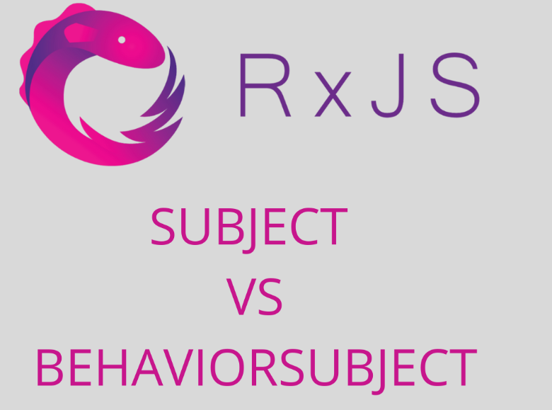
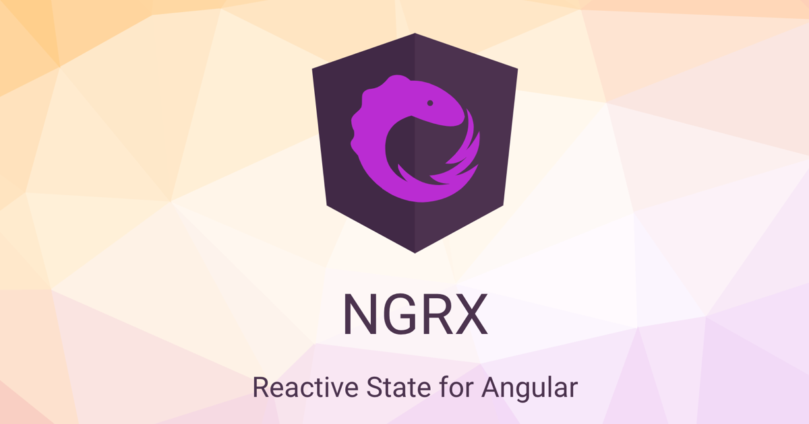

# Gestion d'état dans Angular

La gestion d'état est l'un des défis majeurs du développement d'applications web modernes, particulièrement lorsque celles-ci gagnent en complexité. Dans l'écosystème Angular, plusieurs approches et bibliothèques permettent de relever ce défi. Ce chapitre explore les différentes stratégies pour gérer efficacement l'état de vos applications Angular.

## Comprendre la gestion d'état

### Qu'est-ce que l'état d'une application ?

L'état d'une application représente l'ensemble des données qui peuvent changer au cours de son exécution. Cela inclut :

- Les données récupérées depuis un serveur
- Les entrées utilisateur
- Les sélections et préférences
- Les états d'interface (chargement, erreurs, modales ouvertes, etc.)
- Les paramètres de navigation et de route

Dans une application Angular simple, l'état est souvent géré localement dans les composants. Cependant, cette approche montre rapidement ses limites lorsque l'application se complexifie.

### Problèmes classiques de la gestion d'état

Sans une stratégie adéquate, plusieurs problèmes surgissent :

- **Propagation de données** : Transmettre des données entre composants non liés devient complexe
- **Cohérence** : Maintenir une version unique et fiable des données
- **Synchronisation** : Garantir que tous les composants reflètent le même état
- **Débogage** : Suivre quand, où et pourquoi l'état change
- **Persistance** : Conserver certaines parties de l'état entre les sessions

## Approches de gestion d'état dans Angular

### 1. Services et Injection de Dépendances

La solution la plus simple et native à Angular consiste à utiliser des services comme source de vérité unique.

```typescript
@Injectable({
  providedIn: 'root'
})
export class UserStateService {
  private user = { name: '', isAuthenticated: false };
  
  getUser() {
    return this.user;
  }
  
  setUser(user) {
    this.user = user;
  }
}
```

Cette approche fonctionne bien pour des états simples, mais ne résout pas tous les problèmes de réactivité ni de traçabilité des changements.

---

### 2. Utilisation des Observables et RxJS

Angular s'intègre parfaitement avec RxJS, qui permet une gestion d'état réactive grâce aux observables.

### Différence entre **Subject** et **BehaviorSubject** dans RxJS
[RxJs Subject vs Behaviorsubject](https://writtenforcoders.com/blog/rxjs-subject-vs-behaviorsubject)


**Différence entre Subject et BehaviorSubject dans RxJS**
La principale différence entre un Subject et un BehaviorSubject réside dans leur comportement quant à la valeur initiale et la gestion des abonnements:

#### Subject ####
Un Subject dans RxJS est:

- Un type d'Observable qui peut émettre des valeurs aux abonnés
- Également un Observateur qui peut recevoir des valeurs via les méthodes next(), error() et complete()
- Il ne conserve pas de valeur courante ou d'état
- Les nouveaux abonnés ne reçoivent que les valeurs émises après leur abonnement
- Il n'a pas de valeur initiale

```typescript
// Exemple de Subject
import { Subject } from 'rxjs';

const subject = new Subject<number>();

// Aucune valeur n'est reçue par cet abonné jusqu'à ce qu'une nouvelle valeur soit émise
subject.subscribe(value => console.log('Premier abonné:', value));

// Cet appel déclenche une notification pour tous les abonnés
subject.next(1); // Affiche: "Premier abonné: 1"

// Le nouvel abonné ne reçoit pas la valeur précédente (1)
subject.subscribe(value => console.log('Deuxième abonné:', value));

// Cette valeur est reçue par les deux abonnés
subject.next(2); 
// Affiche: "Premier abonné: 2"
// Affiche: "Deuxième abonné: 2"
```

#### BehaviorSubject

Un BehaviorSubject dans RxJS est:

- Une sous-classe de Subject
- Il conserve toujours la dernière valeur émise
- Il exige une valeur initiale lors de sa création
- Les nouveaux abonnés reçoivent immédiatement la dernière valeur émise (ou la valeur initiale)
- Il permet d'accéder à la valeur actuelle via la méthode getValue()

Le `BehaviorSubject` est particulièrement utile car il :
- Conserve la dernière valeur
- La fournit immédiatement aux nouveaux abonnés
- Permet une mise à jour réactive

```typescript

// Exemple de BehaviorSubject
import { BehaviorSubject } from 'rxjs';

// Valeur initiale obligatoire: 0
const behaviorSubject = new BehaviorSubject<number>(0);

// Reçoit immédiatement la valeur initiale
behaviorSubject.subscribe(value => console.log('Premier abonné:', value));
// Affiche: "Premier abonné: 0"

behaviorSubject.next(1);
// Affiche: "Premier abonné: 1"

// Le nouvel abonné reçoit immédiatement la dernière valeur (1)
behaviorSubject.subscribe(value => console.log('Deuxième abonné:', value));
// Affiche: "Deuxième abonné: 1"

// Accès direct à la valeur actuelle
console.log('Valeur actuelle:', behaviorSubject.getValue()); // Affiche: "Valeur actuelle: 1"
```

Un autre exemple:

```typescript
@Injectable({
  providedIn: 'root'
})
export class CartStateService {
  // État initial
  private cartItems = new BehaviorSubject<Product[]>([]);
  
  // Observable public pour les composants
  public cartItems$ = this.cartItems.asObservable();
  
  addToCart(product: Product) {
    const currentItems = this.cartItems.getValue();
    this.cartItems.next([...currentItems, product]);
  }
  
  removeFromCart(productId: number) {
    const currentItems = this.cartItems.getValue();
    this.cartItems.next(currentItems.filter(item => item.id !== productId));
  }
}
```

Dans les composants :

```typescript
export class CartComponent implements OnInit, OnDestroy {
  items: Product[] = [];
  private subscription: Subscription;
  
  constructor(private cartService: CartStateService) {}
  
  ngOnInit() {
    this.subscription = this.cartService.cartItems$.subscribe(
      items => this.items = items
    );
  }
  
  ngOnDestroy() {
    this.subscription.unsubscribe();
  }
}
```

Cette approche offre plusieurs avantages :
- Communication réactive entre composants
- Pas besoin de passer des données via @Input/@Output sur plusieurs niveaux
- Les composants restent découplés les uns des autres

Pour plus de détails, consulter les liens:

https://angular.love/behaviorsubject-rxjs-reference

https://rxjs-dev.firebaseapp.com/api/index/class/BehaviorSubject

---

### 3. [NGRX](https://ngrx.io/) : Gestion d'état inspirée de [Redux](https://redux.js.org/)


Pour les applications de grande envergure, NgRx implémente le pattern Redux dans Angular, offrant une solution complète et structurée.

#### Concepts clés de NgRx

- **Store** : Conteneur unique pour l'état de l'application
- **Actions** : Événements qui décrivent les changements d'état
- **Reducers** : Fonctions pures qui spécifient comment l'état change en réponse aux actions
- **Selectors** : Fonctions pour extraire des données spécifiques du store
- **Effects** : Gestion des effets secondaires (appels API, etc.)

#### Exemple de mise en œuvre

1. **Définition des actions** :

```typescript
export const login = createAction(
  '[Auth] Login',
  props<{ username: string; password: string }>()
);

export const loginSuccess = createAction(
  '[Auth] Login Success',
  props<{ user: User }>()
);

export const loginFailure = createAction(
  '[Auth] Login Failure',
  props<{ error: string }>()
);
```

2. **Création du reducer** :

```typescript
export interface AuthState {
  user: User | null;
  isAuthenticated: boolean;
  loading: boolean;
  error: string | null;
}

const initialState: AuthState = {
  user: null,
  isAuthenticated: false,
  loading: false,
  error: null
};

export const authReducer = createReducer(
  initialState,
  on(login, state => ({
    ...state,
    loading: true,
    error: null
  })),
  on(loginSuccess, (state, { user }) => ({
    ...state,
    user,
    isAuthenticated: true,
    loading: false
  })),
  on(loginFailure, (state, { error }) => ({
    ...state,
    error,
    loading: false
  }))
);
```

3. **Création d'effects pour gérer les appels API** :

```typescript
@Injectable()
export class AuthEffects {
  login$ = createEffect(() => this.actions$.pipe(
    ofType(login),
    mergeMap(action => 
      this.authService.login(action.username, action.password).pipe(
        map(user => loginSuccess({ user })),
        catchError(error => of(loginFailure({ error: error.message })))
      )
    )
  ));

  constructor(
    private actions$: Actions,
    private authService: AuthService
  ) {}
}
```

4. **Utilisation dans les composants** :

```typescript
@Component({
  selector: 'app-login',
  templateUrl: './login.component.html'
})
export class LoginComponent {
  loading$ = this.store.select(state => state.auth.loading);
  error$ = this.store.select(state => state.auth.error);
  
  constructor(private store: Store<{ auth: AuthState }>) {}
  
  onSubmit(username: string, password: string) {
    this.store.dispatch(login({ username, password }));
  }
}
```

NgRx offre des avantages significatifs :
- Architecture prévisible et structurée
- Traçabilité complète des changements d'état (via Redux DevTools)
- Séparation claire des préoccupations
- Support pour des cas complexes (annulation d'actions, optimistic updates, etc.)

Cependant, cette puissance s'accompagne d'une verbosité et d'une courbe d'apprentissage qui peuvent être excessives pour des applications simples.

### 4. NgRx Component Store

Pour les applications de taille moyenne, NgRx propose une alternative légère : Component Store.

```typescript
@Injectable()
export class TodosStore extends ComponentStore<TodosState> {
  constructor(private todosService: TodosService) {
    super({ todos: [], loading: false });
    this.loadTodos();
  }

  // Updaters
  readonly setLoading = this.updater((state, loading: boolean) => ({
    ...state,
    loading
  }));
  
  readonly addTodo = this.updater((state, todo: Todo) => ({
    ...state,
    todos: [...state.todos, todo]
  }));

  // Effects
  readonly loadTodos = this.effect(trigger$ => trigger$.pipe(
    tap(() => this.setLoading(true)),
    switchMap(() => this.todosService.getTodos().pipe(
      tap(todos => {
        this.setLoading(false);
        this.patchState({ todos });
      }),
      catchError(() => {
        this.setLoading(false);
        return EMPTY;
      })
    ))
  ));
}
```

### 5. NGXS

Une alternative populaire à NgRx, [NGXS](https://www.ngxs.io/) propose une syntaxe plus simple basée sur les classes et les décorateurs.

"NGXS is a state management pattern + library for Angular. It acts as a single source of truth for your application's state, providing simple rules for predictable state mutations.

NGXS is modeled after the CQRS pattern popularly implemented in libraries like Redux and NgRx but reduces boilerplate by using modern TypeScript features such as classes and decorators."


```typescript
@State<TodosStateModel>({
  name: 'todos',
  defaults: {
    items: [],
    loading: false
  }
})
@Injectable()
export class TodosState {
  @Selector()
  static getTodos(state: TodosStateModel) {
    return state.items;
  }
  
  @Action(AddTodo)
  addTodo(ctx: StateContext<TodosStateModel>, action: AddTodo) {
    const state = ctx.getState();
    ctx.setState({
      ...state,
      items: [...state.items, action.payload]
    });
  }
  
  @Action(FetchTodos)
  fetchTodos(ctx: StateContext<TodosStateModel>, action: FetchTodos) {
    ctx.patchState({ loading: true });
    return this.todosService.getTodos().pipe(
      tap(todos => {
        ctx.patchState({
          items: todos,
          loading: false
        });
      })
    );
  }
  
  constructor(private todosService: TodosService) {}
}
```

### 6. Akita

Akita propose une approche orientée entité pour la gestion d'état.

```typescript
// Store
export interface TodosState extends EntityState<Todo> {
  loading: boolean;
}

@StoreConfig({ name: 'todos' })
export class TodosStore extends EntityStore<TodosState> {
  constructor() {
    super({ loading: false });
  }
}

// Query
export class TodosQuery extends QueryEntity<TodosState> {
  selectLoading$ = this.select(state => state.loading);
  
  constructor(protected store: TodosStore) {
    super(store);
  }
}

// Service
@Injectable({ providedIn: 'root' })
export class TodosService {
  constructor(
    private todosStore: TodosStore,
    private http: HttpClient
  ) {}
  
  getTodos() {
    this.todosStore.setLoading(true);
    return this.http.get<Todo[]>('/api/todos').pipe(
      tap(todos => {
        this.todosStore.set(todos);
        this.todosStore.setLoading(false);
      })
    );
  }
}
```

## Choisir la bonne approche

Le choix d'une solution de gestion d'état dépend de plusieurs facteurs :

| Approche | Complexité | Taille d'application | Avantages | Inconvénients |
|----------|------------|----------------------|-----------|---------------|
| Services + RxJS (BehaviorSubject) | Faible | Petite à moyenne | Simple, natif à Angular | Limité pour applications complexes |
| NgRx | Élevée | Grande | Robuste, traçable, structuré | Verbeux, courbe d'apprentissage |
| Component Store | Moyenne | Moyenne | Équilibre entre simplicité et structure | Moins puissant que NgRx complet |
| NGXS | Moyenne | Moyenne à grande | API plus simple que NgRx | Moins mature que NgRx |
| Akita | Moyenne | Moyenne à grande | Orienté entité, productif | Bibliothèque tierce |

## Bonnes pratiques

Quelle que soit l'approche choisie, certains principes restent universels :

1. **Source unique de vérité** : L'état doit être centralisé
2. **Immutabilité** : Ne jamais modifier l'état directement
3. **Accès en lecture seule** : Les composants ne doivent pas pouvoir modifier l'état directement
4. **Actions explicites** : Les modifications d'état doivent être clairement définies
5. **Séparation des préoccupations** : Distinguer la gestion d'état de la logique d'interface

## Stratégies avancées

### État local vs global

Tout ne doit pas être dans le store global. Stratégies de séparation :

- **État global** : Données partagées entre plusieurs composants, persistantes
- **État de fonctionnalité** : Spécifique à un module/feature
- **État local** : Spécifique à un composant, temporaire

### Optimisation des performances

- Utiliser la stratégie OnPush pour les composants
- Memoïser les sélecteurs avec des fonctions pures
- Éviter de stocker des données dérivables

### Débogage et développement

- Redux DevTools pour NgRx et NGXS
- Journalisation des changements d'état
- Tests unitaires des reducers et selectors

## Conclusion

La gestion d'état est un aspect fondamental du développement d'applications Angular complexes. Bien qu'il n'existe pas de solution universelle, comprendre les différentes approches permet de choisir celle qui convient le mieux à chaque projet. En suivant les principes de base et en adoptant une architecture réfléchie, vous pouvez créer des applications prévisibles, maintenables et performantes.

Les services Angular avec RxJS constituent un excellent point de départ, tandis que NgRx, NGXS ou Akita offrent des solutions plus structurées pour les applications de grande envergure. L'essentiel est de maintenir la cohérence dans l'approche choisie et d'adapter la stratégie à la complexité réelle de l'application.
