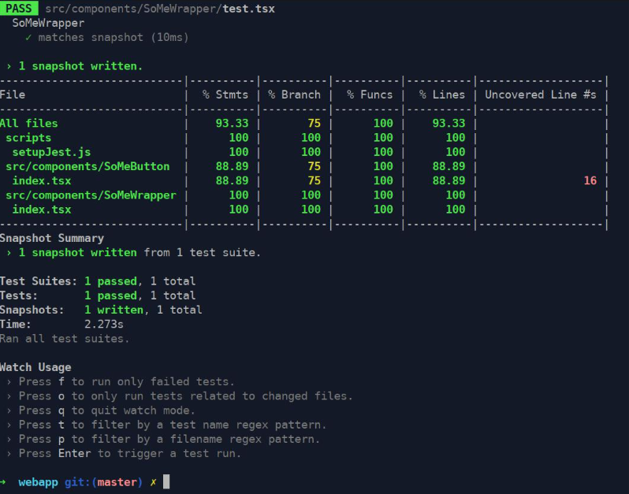

# 🧪 Tester une application Angular avec Jest 

Jest est une alternative moderne à Karma + Jasmine pour réaliser des tests dans un projet Angular. Il est rapide, facile à configurer, et très apprécié pour son intégration avec TypeScript et les outils modernes de test comme Testing Library.

---

## 📚 Sommaire

- [Pourquoi utiliser Jest ?](#pourquoi-utiliser-jest)
- [Installation et configuration](#installation-et-configuration)
- [Écrire des tests unitaires avec Jest](#écrire-des-tests-unitaires-avec-jest)
- [Tester un composant Angular](#tester-un-composant-angular)
- [Utiliser Testing Library avec Jest](#utiliser-testing-library-avec-jest)
- [Tester un service Angular](#tester-un-service-angular)
- [Conclusion](#conclusion)


---

## Pourquoi utiliser Jest ?

✅ Plus rapide que Karma (pas besoin de navigateur)  
✅ Très bon support TypeScript  
✅ Intégration facile dans CI/CD  
✅ Couverture de code intégrée  
✅ Grande communauté



---

## Installation et configuration

Installe Jest avec Angular CLI :

```bash
ng add @briebug/jest-schematic
```

Cette commande :
- Installe Jest (`jest`, `ts-jest`, `jest-preset-angular`)
- Supprime Karma et Jasmine
- Modifie les scripts de test (`package.json`)
- Convertit les fichiers de configuration

Pour lancer les tests :

```bash
npm test
```

---

## Écrire des tests unitaires avec Jest

Voici un exemple simple :

```ts
// utils.ts
export function sum(a: number, b: number): number {
  return a + b;
}
```

```ts
// utils.spec.ts
import { sum } from './utils';

describe('sum', () => {
  it('devrait additionner deux nombres', () => {
    expect(sum(1, 2)).toBe(3);
  });
});
```

---

## Tester un composant Angular

```ts
import { ComponentFixture, TestBed } from '@angular/core/testing';
import { HeaderComponent } from './header.component';

describe('HeaderComponent', () => {
  let component: HeaderComponent;
  let fixture: ComponentFixture<HeaderComponent>;

  beforeEach(async () => {
    await TestBed.configureTestingModule({
      declarations: [HeaderComponent]
    }).compileComponents();

    fixture = TestBed.createComponent(HeaderComponent);
    component = fixture.componentInstance;
    fixture.detectChanges();
  });

  it('devrait être créé', () => {
    expect(component).toBeTruthy();
  });
});
```

---

## Utiliser Testing Library avec Jest

Installation :

```bash
npm install --save-dev @testing-library/angular @testing-library/jest-dom
```

Exemple de test :

```ts
import { render, screen } from '@testing-library/angular';
import { WelcomeComponent } from './welcome.component';

it('devrait afficher un message de bienvenue', async () => {
  await render(WelcomeComponent, {
    componentProperties: { name: 'Jean' },
  });

  expect(screen.getByText('Bienvenue, Jean!')).toBeTruthy();
});
```

---

## Tester un service Angular

```ts
import { TestBed } from '@angular/core/testing';
import { AuthService } from './auth.service';

describe('AuthService', () => {
  let service: AuthService;

  beforeEach(() => {
    TestBed.configureTestingModule({});
    service = TestBed.inject(AuthService);
  });

  it('devrait retourner false si non connecté', () => {
    expect(service.isLoggedIn()).toBe(false);
  });
});
```

---

## Conclusion

- ✅ **Jest** est un excellent choix pour remplacer Karma + Jasmine.
- 🔄 Compatible avec Angular CLI via `@briebug/jest-schematic`
- 🧪 Combine très bien avec Testing Library pour tester les composants de manière plus réaliste

💡 Conseil : commence par convertir tes tests unitaires avec Jest, puis adopte Testing Library pour les tests de composants plus complexes.

---


