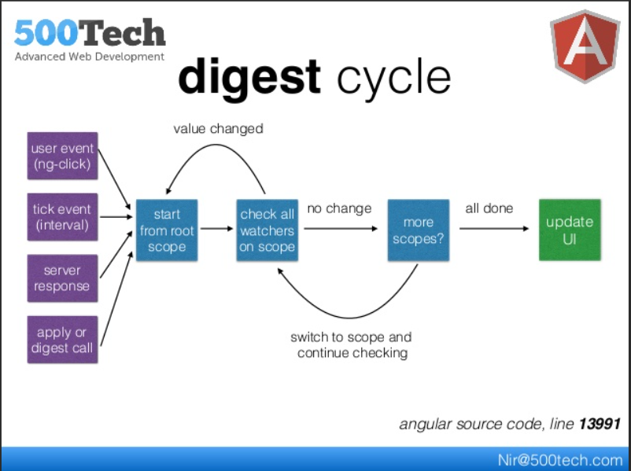

# AngularJS — Data Binding et Directives

AngularJS fournit un système puissant de **liaison de données (data-binding)** et de **directives** qui permet de créer des interfaces utilisateurs dynamiques avec peu de code. 
---

## 🔁 Data Binding (liaison de données)

La liaison de données en AngularJS permet de **synchroniser automatiquement** le modèle (JavaScript) et la vue (HTML).

### 🔹 Liaison unidirectionnelle (**interpolation**) (`{{ }}`)

Elle permet d'afficher une valeur du modèle dans la vue :

```html
<p>{{ nom }}</p>
```

Dans le contrôleur :

```javascript
$scope.nom = "Jean";
```

### 🔹 Liaison bidirectionnelle (**Two Way Data Binding**) (`ng-model`)

Permet de lier un champ de formulaire à une variable du modèle. Toute modification se reflète des deux côtés.

```html
<input type="text" ng-model="nom">
<p>Bonjour {{ nom }}</p>
```

---

## 🧩 Directives AngularJS

Les **directives** sont des attributs HTML spéciaux (ou balises) qui ajoutent des comportements dynamiques à vos éléments HTML.

### 🔹 Directives intégrées

| Directive     | Description |
|---------------|-------------|
| `ng-model`    | Lier une variable à un champ de formulaire |
| `ng-bind`     | Afficher une valeur (équivalent à `{{ }}`) |
| `ng-repeat`   | Répéter un élément pour chaque élément d'une liste |
| `ng-if`       | Afficher un élément si une condition est vraie |
| `ng-show` / `ng-hide` | Afficher ou masquer un élément dynamiquement |
| `ng-click`    | Réagir à un clic de l'utilisateur |

### 🔹 Exemple : `ng-repeat`

```html
<ul>
  <li ng-repeat="fruit in fruits">{{ fruit }}</li>
</ul>
```

Dans le contrôleur :

```javascript
$scope.fruits = ["Pomme", "Banane", "Mangue"];
```

---

## 🔧 Exemple complet

```html
<!DOCTYPE html>
<html ng-app="monApp">
<head>
  <script src="https://ajax.googleapis.com/ajax/libs/angularjs/1.8.2/angular.min.js"></script>
  <script>
    angular.module('monApp', [])
      .controller('MainCtrl', function($scope) {
        $scope.nom = "Alice";
        $scope.fruits = ["Pomme", "Banane", "Mangue"];
      });
  </script>
</head>
<body ng-controller="MainCtrl">
  <input ng-model="nom">
  <h1>Bonjour {{ nom }} !</h1>

  <ul>
    <li ng-repeat="fruit in fruits">{{ fruit }}</li>
  </ul>
</body>
</html>
```

---

## ✅ Résumé

| Concept             | But                                         |
|---------------------|----------------------------------------------|
| `{{ variable }}`    | Affiche une valeur du modèle dans la vue     |
| `ng-model`          | Liaison bidirectionnelle                     |
| `ng-repeat`         | Boucle sur un tableau                        |
| `ng-click`          | Gérer un clic utilisateur                    |
| `ng-if`, `ng-show`  | Contrôle d'affichage conditionnel            |

---

AngularJS vous permet de créer rapidement des interfaces dynamiques grâce à un système de directives puissantes et une liaison des données intuitive.


---


# Comparaison entre `$scope` dans AngularJS et les objets équivalents en ASP.NET MVC

Dans **AngularJS**, on utilise souvent `$scope` pour lier des données entre le contrôleur et la vue.

En **ASP.NET MVC**, les objets équivalents pour passer des données du contrôleur vers la vue sont :

## 🔹 `ViewBag`

- Objet **dynamique**.
- Permet de passer des données du contrôleur à la vue sans déclaration de type.
- Syntaxe dans le contrôleur :
  ```csharp
  ViewBag.Titre = "Bonjour";
  ```
- Utilisation dans la vue Razor :
  ```razor
  <h1>@ViewBag.Titre</h1>
  ```

## 🔹 `ViewData`

- C’est un **dictionnaire** (`ViewDataDictionary`) avec des paires clé-valeur.
- Syntaxe dans le contrôleur :
  ```csharp
  ViewData["Titre"] = "Bonjour";
  ```
- Utilisation dans la vue Razor :
  ```razor
  <h1>@ViewData["Titre"]</h1>
  ```

## ⚠️ Différences entre `$scope` (AngularJS) et `ViewBag`/`ViewData` (ASP.NET MVC)

| Caractéristique                 | AngularJS (`$scope`)                          | ASP.NET MVC (`ViewBag` / `ViewData`)       |
|-------------------------------|-----------------------------------------------|--------------------------------------------|
| Utilisation principale         | Liaison bidirectionnelle (two-way binding)   | Passage de données du contrôleur à la vue  |
| Portée                         | Côté client (navigateur)                     | Côté serveur (C#)                          |
| Dynamique ou typé              | Dynamique                                    | `ViewBag` = dynamique, `ViewData` = dictionnaire |
| Actualisation dynamique de l’UI | Oui, via le data-binding AngularJS          | Non, données figées à la génération HTML   |

---

## ✅ Recommandation : Utiliser un `ViewModel`

Pour une solution plus propre et fortement typée, on peut utiliser un modèle de vue (`ViewModel`).

### Exemple de ViewModel

```csharp
public class MonViewModel
{
    public string Titre { get; set; }
    public int Nombre { get; set; }
}
```

### Contrôleur

```csharp
public ActionResult Index()
{
    var model = new MonViewModel
    {
        Titre = "Bonjour",
        Nombre = 42
    };

    return View(model);
}
```

### Vue Razor

```razor
@model MonViewModel

<h1>@Model.Titre</h1>
<p>Nombre : @Model.Nombre</p>
```

---

## ✅ Résumé

| Fonction                             | AngularJS       | ASP.NET MVC                   |
|--------------------------------------|------------------|--------------------------------|
| Lier les données à la vue            | `$scope`         | `ViewBag`, `ViewData`, `Model` |
| Liaison bidirectionnelle             | Oui              | Non                           |
| Typage fort                          | Non              | Oui (avec `Model`)            |
| Portée                               | Côté client      | Côté serveur                  |


---

## Angular Context ou Digest Loop
Le **Digest Loop** (ou boucle de digestion) est un mécanisme central du **système de liaison de données (data-binding)** dans **AngularJS (v1.x)**. Il permet à AngularJS de **détecter automatiquement les changements** dans les données et de mettre à jour la vue en conséquence.

## 🧠 Qu’est-ce que le Digest Loop ?
Le Digest Loop est le processus par lequel AngularJS :

* Parcourt toutes les expressions liées au $scope dans la vue (ex: {{ nom }})
* Compare la valeur actuelle et la valeur précédente
* Met à jour la vue si un changement est détecté

Ce cycle est appelé une **"boucle de digestion"** (digest loop) car il vérifie les modifications en boucle, jusqu’à ce que tous les modèles soient à jour.




## 🔁 Comment ça fonctionne ?
Exemple :
```html
<p>{{ nom }}</p>
<input ng-model="nom">
```
Lorsque vous modifiez la valeur du champ de saisie (`input`), AngularJS :

* Met à jour `$scope.nom`
* Lance un digest loop
* Compare l’ancienne et la nouvelle valeur de `nom`
* Met à jour le DOM (`<p>{{ nom }}</p>`) automatiquement

## 🔍 Étapes du digest loop
1. Le digest loop est déclenché (souvent par ng-click, ng-model, $http, etc.)
2. AngularJS parcourt tous les watchers (fonctions qui surveillent des expressions)
3. Pour chaque watcher :
  * Évalue l'expression liée
  * Compare à la valeur précédente
  * Si différent : met à jour la vue et marque le digest comme `"dirty"`
4. Le cycle recommence jusqu’à ce qu’aucun changement ne soit détecté
5. Le loop s’arrête après **10 cycles max** (sinon : erreur `10 $digest() iterations reached`)

## ⚠️ Important : $scope.$digest() vs $scope.$apply()
| Méthode            | Description                                          |
| ------------------ | ---------------------------------------------------- |
| `$scope.$digest()` | Lance la boucle **dans le scope courant uniquement** |
| `$scope.$apply()`  | Lance un digest global **à partir de `$rootScope`**  |

## 🔥 Que surveille AngularJS ?
AngularJS surveille les expressions dans :

* {{ expressions }}
* ng-model
* ng-show, ng-hide
* ng-class
* Etc.

**Mais ne surveille pas automatiquement** les changements faits **hors d’Angular**, comme dans un `setTimeout`, `eventListener` natif, ou une lib jQuery.

➡️ Dans ces cas-là, il faut envelopper le code dans `$scope.$apply()` pour que le digest loop soit déclenché.

## 🛠️ Exemple manuel
```javascript
setTimeout(function() {
  $scope.nom = "Nouveau Nom";
  $scope.$apply(); // Indique à AngularJS de lancer un digest
}, 1000);
```

## 📉 Problèmes potentiels
* **Performance** : trop de watchers = digest loop lent
* **Erreurs silencieuses** si on oublie `$apply()`
* **Boucle infinie** si les valeurs ne se stabilisent pas (`10 digest iterations reached`)

## ✅ Résumé
| Élément            | Rôle                                                    |
| ------------------ | ------------------------------------------------------- |
| Digest Loop        | Met à jour la vue si les données changent               |
| `$scope.$digest()` | Lance une vérification dans un scope                    |
| `$scope.$apply()`  | Lance une vérification globale                          |
| Watcher            | Surveille un champ `$scope` pour détecter un changement |


---

# 📘 Directives AngularJS Courantes

[Directive components in ng](https://docs.angularjs.org/api/ng/directive)

Les **directives** dans AngularJS sont des attributs ou des éléments personnalisés qui permettent d'ajouter du comportement dynamique aux éléments HTML.

---

## 🔹 `ng-app`

- **Rôle** : Initialise une application AngularJS.
- **Utilisation** :
  ```html
  <html ng-app="monApp">
  ```

---

## 🔹 `ng-model`

- **Rôle** : Crée une liaison bidirectionnelle entre un champ HTML et une variable du `$scope`.
- **Utilisation** :
  ```html
  <input ng-model="nom">
  <p>Bonjour {{ nom }}</p>
  ```

---

## 🔹 `ng-bind`

- **Rôle** : Affiche une valeur du modèle dans le HTML (équivalent à `{{ }}`).
- **Utilisation** :
  ```html
  <p ng-bind="nom"></p>
  ```

---

## 🔹 `ng-repeat`

- **Rôle** : Répète un élément HTML pour chaque élément d’une collection.
- **Utilisation** :
  ```html
  <li ng-repeat="fruit in fruits">{{ fruit }}</li>
  ```

---

## 🔹 `ng-if`

- **Rôle** : Affiche ou supprime un élément du DOM selon une condition.
- **Utilisation** :
  ```html
  <p ng-if="estVisible">Je suis visible</p>
  ```

---

## 🔹 `ng-show` / `ng-hide`

- **Rôle** : Affiche (`ng-show`) ou cache (`ng-hide`) un élément en utilisant `display: none`.
- **Utilisation** :
  ```html
  <p ng-show="estConnecte">Bienvenue</p>
  <p ng-hide="estConnecte">Veuillez vous connecter</p>
  ```

---

## 🔹 `ng-click`

- **Rôle** : Exécute une fonction lorsqu’un élément est cliqué.
- **Utilisation** :
  ```html
  <button ng-click="incrementer()">+1</button>
  ```

---

## 🔹 `ng-class`

- **Rôle** : Ajoute dynamiquement une ou plusieurs classes CSS selon une condition.
- **Utilisation** :
  ```html
  <p ng-class="{ actif: estActif }">Statut</p>
  ```

---

## 🔹 `ng-init`

- **Rôle** : Initialise des variables au chargement de la vue.
- **Utilisation** :
  ```html
  <div ng-init="nombre=5"></div>
  ```

---

## 🔹 `ng-submit`

- **Rôle** : Gère la soumission d’un formulaire.
- **Utilisation** :
  ```html
  <form ng-submit="soumettreFormulaire()">
  ```

---

## ✅ Résumé

| Directive    | Rôle                                      |
|--------------|--------------------------------------------|
| `ng-app`     | Initialise l'application AngularJS         |
| `ng-model`   | Liaison bidirectionnelle                   |
| `ng-bind`    | Affiche une valeur                         |
| `ng-repeat`  | Répète un élément pour chaque item         |
| `ng-if`      | Affiche ou non un élément (DOM)            |
| `ng-show`    | Affiche un élément (`display: block`)      |
| `ng-hide`    | Cache un élément (`display: none`)         |
| `ng-click`   | Réagit à un clic                           |
| `ng-class`   | Applique dynamiquement des classes CSS     |
| `ng-init`    | Initialise des variables                   |
| `ng-submit`  | Gère la soumission d’un formulaire         |

---

Les directives AngularJS permettent de créer des interfaces interactives et dynamiques en enrichissant le HTML standard avec des comportements réactifs.
